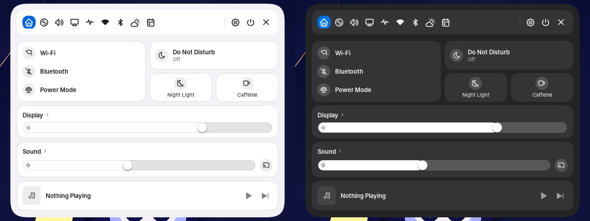
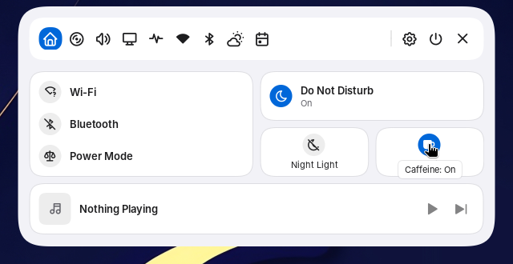
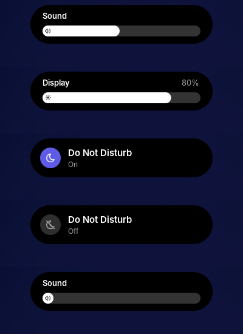

# What still looks un-Mac-like on the merged shell

Branch `feature/orbit-island` at d9b6be4 (all of PRs #1 to #21), light and dark, headless Sway at 1920x1080, Inter (no SF Pro), no blur, Papirus icons.
Screenshots are in [assets/merged-survey](assets/merged-survey/). Ranked by how often you'd see each one.

## Clear-cut (fixed on this branch)

After screenshots: [monogram](assets/merged-survey/fixes/control-center-monogram.png), [Light first](assets/merged-survey/fixes/theme-mode-light-first.png), [chevrons](assets/merged-survey/fixes/settings-index-chevrons.png), [empty wallpaper panel](assets/merged-survey/fixes/wallpaper-empty-state.png).

1. **Control Center profile card has a hole where the avatar goes.** With no avatar picture set, the card shows an empty space and the name floats to the right of it ([control-center-light.png](assets/merged-survey/control-center-light.png), [control-center-dark.png](assets/merged-survey/control-center-dark.png)). macOS shows a grey circle with your initials, and the lock screen here already does. Fix: the same initials circle in the Control Center.
2. **Light and Dark are in the wrong order.** Theme Mode reads "Dark | Light | Auto" and Shell Theme Mode "Follow | Dark | Light | Auto" ([settings-theme-order.png](assets/merged-survey/settings-theme-order.png)); the wallpaper panel and setup wizard do the same. System Settings > Appearance reads Light, Dark, Auto. Fix: put Light first everywhere.
3. **Settings index rows put the chevron next to the word.** Appearance's index reads "Theme  ›", "Interface  ›" with the chevron right after the label ([settings-appearance-index.png](assets/merged-survey/settings-appearance-index.png)). In System Settings the chevron sits at the right edge of the row. Same on the Plugins page.
4. **The wallpaper panel opens to a blank box when the folder has no images** ([wallpaper-empty.png](assets/merged-survey/wallpaper-empty.png)). macOS always says what's missing. Fix: a "No Wallpapers" message naming the folder it looked in.

## Picked by harvey (also fixed on this branch)

After screenshots: [banner icon](assets/merged-survey/fixes/island-banner-large-icon.png), [sidebar without headings](assets/merged-survey/fixes/settings-sidebar-no-headings.png). The switcher now stays hidden when no windows are open.

5. **Island notification banner icon is tiny.** The banner shows a 16 px icon beside the app name ([island-banner-icons.png](assets/merged-survey/island-banner-icons.png)); a macOS banner leads with a large app icon (about 38 px) next to the title and body. Proposal: a larger leading icon, keeping the black capsule.
6. **Settings sidebar has group headings** ("Personalise", "Devices", "Windows & workspaces", "General"). Ventura's sidebar has no headings, only gaps between groups. Proposal: drop the headings and keep the gaps.
7. **Window switcher with no windows** shows a "0 windows" chip and "No open windows" over the screen ([window-switcher-empty.png](assets/merged-survey/window-switcher-empty.png)). Under Sway it stayed up until closed by command, because Sway gives it no window list. On Hyprland it should close when you let go of the modifier; please check. Proposal: don't open it at all when there are no windows, as Cmd+Tab never shows an empty strip.

## Needs your machine

- Notification Centre cards look grey in light mode without blur ([notification-centre-light.png](assets/merged-survey/notification-centre-light.png)). With Hyprland's blur they may look right; tell me if they look dull.
- Notifications that name their icon (for example Firefox's) showed a bell here, because this container's icon theme lookup didn't find them. Icons given by path or desktop entry work ([island-banner-icons.png](assets/merged-survey/island-banner-icons.png)). Check whether your notifications show app icons.
- The volume and brightness popups, the lock screen and real window switching can't run in this container.

## Already close

Launcher and its /clip, /snip and web fallback ([launcher-modes.png](assets/merged-survey/launcher-modes.png)), session cards, password prompt, Copied pill and script activity ([island-pills.png](assets/merged-survey/island-pills.png)), tray drawer empty state, Settings sidebar icons, dark mode across panels.

## Small and not about looks

- A pinned dock app written with ".desktop" on the end (for example `org.codeberg.dnkl.foot.desktop`) shows a blank placeholder; the docs say it should match. Easy to fix if you want it.

## Second pass (3 October 2026, evening): launcher and panels on the merged branch with the Raycast changes

Headless Sway at 1920x1080, Inter, Papirus, light and dark. Screenshots of the launcher are in [assets/launcher-raycast](assets/launcher-raycast/).

Fixed on this branch:

- The `/` overview put its internal provider id (`__launcher_provider_overview__`) in the action bar's kind label. Overview rows now read **Command** there and at the trailing edge.
- Going back to the root search from a short or empty provider view (Esc from `/clip`) scrolled the first section header out of view: the grid brought the selected row into a viewport that still had the shorter list's height. The grid now never scrolls a row's own top away.
- An empty provider view said "No results found" with nothing typed; it now says "Nothing in Clipboard History yet".

Still as before, and fine: the launcher card, section headers, kind labels and the action bar match Raycast's proportions in both themes; Control Center, the notification stack, session cards, the wallpaper picker, Settings and the dock read as Ventura. The sway title bar above Settings and the missing dock magnification are the headless compositor, not the shell.

## Third pass (3 October 2026, night): the whole shell after the Raycast, AI and lock screen work

Headless Sway at 1920x1080, Inter, Papirus, light and dark: desktop and Island, the launcher's root and provider views, Control Center, the notification banner and centre, session, wallpaper, Settings (index, Appearance, Launcher), the dock, the OSD pill, an internal notification, and the lock screen. Dark mode matches light everywhere.

Fixed on this branch:

- **Internal notifications had no icon.** A banner from the shell itself ("Noctalia") started its text at the edge where every app banner leads with an icon. Internal notifications now carry the shell's own icon and desktop id, so the Island banner, the toast and the history show the owl like any app's icon.
- **Dock pins written with `.desktop` showed a blank tile.** Desktop entry ids are file stems, so `org.codeberg.dnkl.foot.desktop` never matched. A pin now matches with or without the suffix, or by the file's full path; the docs described `StartupWMClass` and `Name` matching that the code never did, and now describe what it does.
- **The Control Center's power tile read "Power" under a balance-scale glyph** (the balanced profile's icon). It reads "Power Mode" now.
- **Settings opened with its page floating mid-way between the sidebar and the window's edge.** The page column is capped (System Settings keeps its rows a fixed width) but was centred in the space beside the sidebar, so a tiled window showed a gap as wide as the page before the first control. The column now starts beside the sidebar and may grow to 860 px; the spare width of a wide window stays on the right, where macOS leaves it too.

Looked at and left:

- The Island OSD pill from `noctalia msg osd-show` shows only icon and text, as that command is a status message; the real volume and brightness popups draw the level bar under the label (`volume_show_percentage` hides the number), which is the notch HUD look.
- "Clear All" in the Notification Centre sits flush with the cards' right edge, a 16 px margin from the screen edge, which is where macOS puts its group controls.
- The lock screen after the Cupertino tweaks: large time over the date, avatar ring, centred password pill, Sleep / Restart / Shut Down (see [assets/lockscreen](assets/lockscreen/)).

## Fourth pass (3 October 2026, late): motion

The springs are faster than a software `grim` capture, so this pass ran with `shell.animation.speed = 0.12` and took frame bursts of the Island hosting Control Center and the launcher (open and close), a banner arriving and leaving, Control Center's tab switch, the launcher changing height for a provider view, the session panel, the OSD pill, and the dock's menu and tooltips.

Fixed on this branch:

- **The Island changed colour at the wrong moment.** The hosted panel's card was the panel surface colour (near white in light mode) from the first frame, so opening snapped a light card onto the black pill and closing shrank a light card down to pill size before the black Island reappeared, which read as a flash. The card now blends from the Island's own colour to the surface as it grows and back before it lands, while the content fades as before; a resize between two panel sizes stays on the surface.
- **The dock's menu opened with its first item already highlighted**, a full-width accent bar under a pointer that wasn't over it, and the icon's tooltip stayed on top of the menu. Context menus now open with nothing highlighted until the pointer enters a row or the arrow keys move (Down lands on the first row, Up on the last); the dock hides the tooltip when its menu opens; and the menu's minimum width follows its contents (168 px) instead of 240 px.

Looked at and left: the launcher's height change to a provider view, the session panel's open, the Control Center tab switch and the OSD pill all read as one capsule changing shape; the banner buds out of the pill, fills, and returns to the compact state.

## Fifth pass (3 October 2026, later): tooltips

The tooltip layer already sized its bubble to the text (wrapping at 280 px) and refreshed live content, but most controls told it nothing: the Control Center tiles only had a tooltip when their captions were hidden, and then only the caption, and the Settings window's header buttons had none.

Fixed on this branch:

- **Control Center tiles describe their state.** Each shortcut now reports a status, and the tile's tooltip reads like a macOS menu bar extra: "Wi-Fi: Home-5G" (or "Not connected", "Off"), "Bluetooth: AirPods Pro" (the connected devices, or "On"), "Night Light: Scheduled", "DND: On", "Caffeine: Off", "Audio: 45%" or "Audio: Muted", "Microphone: Muted", "Power Mode: Performance", "Appearance: Auto", "Weather: 18°C Partly cloudy · London", "Keyboard Layout: English (US)", "Media: Playing · Track – Artist". The text is re-read every second while the bubble shows, so clicking the tile updates it in place. With captions on, a tile with no state to add (System, Session, Wallpaper…) shows no tooltip, as the caption already says what it is; with captions off every tile has one.
- **The Settings window's header buttons have tooltips**: "More Actions" on the ellipsis and "Close" on the close button.

Looked at and left: the bar widgets (network, volume, battery, Bluetooth, weather, system monitor, clock) already show key/value tables that resize to their rows, and the dock and taskbar show the window's own title.

## Sixth pass (4 October 2026): the Big Sur Control Center as the reference

Harvey supplied a screenshot of the macOS Big Sur Control Center (the main panel and its Display, Sound, Do Not Disturb, AirDrop and Screen Mirroring menus) as the reference for the Control Center and the Island.

Changed on this branch:

- **Home is laid out as Big Sur's modules** (`[control_center.home] layout = "modules"`, the new default). The first three shortcuts are rows of one module, each a round toggle with the name and its state under it ("Wi-Fi / Home-5G", "Power Mode / Balanced"); the fourth is the wide tile beside it (Do Not Disturb by default, as on macOS); the fifth and sixth are small tiles under that. Below them are the Display and Sound modules, each a title over a thick white-filled slider with its symbol inside the groove (Sound has the round output button that opens the Audio tab), and Now Playing with the artwork, track, play/pause and next. Toggles fill with the accent when on and are grey discs when off. A click on a name or a module title opens its tab, as a click on "Wi-Fi" or "Sound" does on macOS. Display shows only with a writable backlight or DDC display; Sound only with PipeWire.
- **The default shortcut order** became Wi-Fi, Bluetooth, Power Mode, Do Not Disturb, Night Light, Caffeine, so the modules match the reference. DND's caption reads "Do Not Disturb" and its symbol is the moon.
- **The dashboard stays** as `layout = "dashboard"`, unchanged apart from the new caption; `cards` gains `display` and `sound`.
- **The Island's volume, microphone and brightness OSDs** (Cupertino look) are Big Sur's Sound and Display modules on the black capsule: the name, the level at the right where shown, and the white-filled groove with the symbol inside.
- **The Do Not Disturb and Charging pills** draw the Big Sur tile: a solid indigo (or green) round toggle with a white symbol, grey when off, and the name with its state under it.

The container has no backlight or PipeWire, so the Display and Sound modules in the first screenshot came from a probe build that forced them on with fixed levels; the shipped code shows them only when the services exist. The OSD screenshots came from a probe build that let `osd-show` send level and DND events. Neither hook is in the branch.
